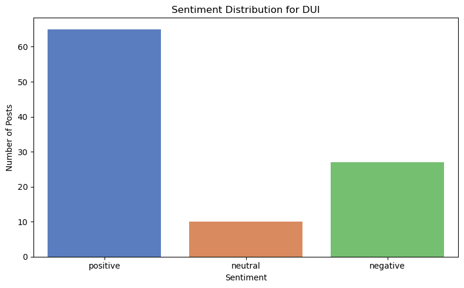
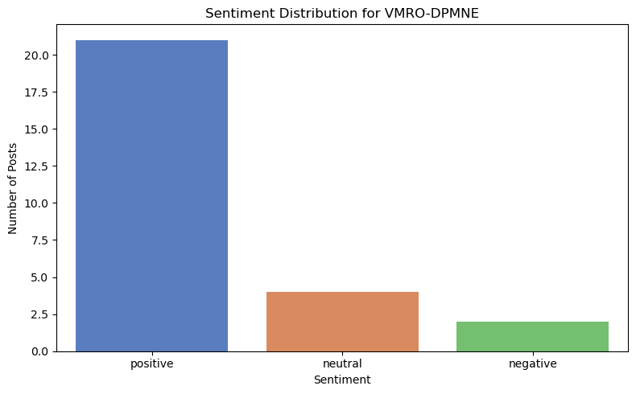
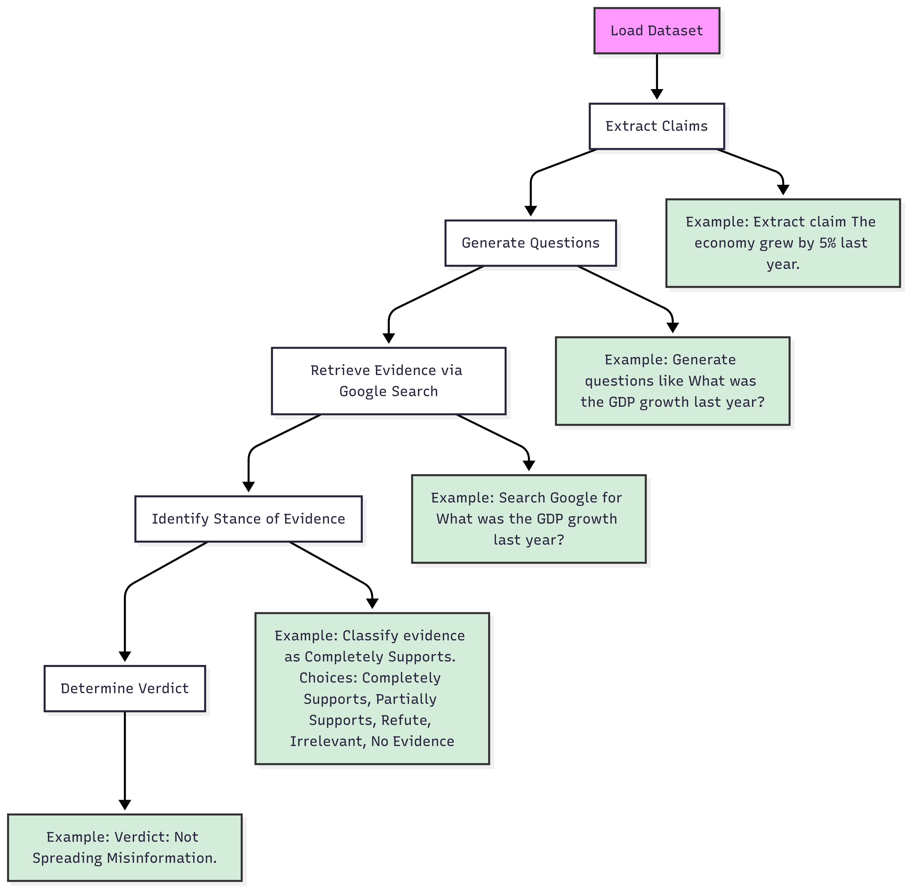

# North Macedonia Election Fact-Checking and Sentiment Analysis Project
*EPFL Law and Computation I & II Project*

This project aims to analyze and visualize sentiment and claims from social media posts related to the 2024 North Macedonian elections. It involves data preprocessing, sentiment analysis, and fact-checking pipelines, supported by visualizations to provide insights into the political discourse.

---

## Project Structure

### 1. Data Preprocessing Pipeline (`data-preprocessing-pipeline.ipynb`)
This notebook prepares the raw datasets for analysis. It performs the following steps:

1. **Load Raw Data**: Reads CSV files containing social media posts for various political parties.
2. **Extract Relevant Columns**: Focuses on columns like `ad_archive_id`, `ad_creative_bodies`, and other metadata.
3. **Clean Data**: Removes rows with missing or invalid `ad_creative_bodies`.
4. **Save Processed Data**: Outputs cleaned CSV files for each party in the `dataset/ad-creative-bodies-extraction/` folder.

#### Example Output:
- `DUI_ad_creative_bodies.csv`
- `VMRO-DPMNE_ad_creative_bodies.csv`

---

### 2. Sentiment Analysis Pipeline (`sentiment-analysis-pipeline.ipynb`)
This notebook performs sentiment analysis on the processed datasets. It includes:

1. **Load Processed Data**: Reads the cleaned CSV files for each party.
2. **Translate Text**: Uses Google Translate to convert non-English text to English.
3. **Sentiment Analysis**: Applies the VADER sentiment analyzer to classify posts as `positive`, `neutral`, or `negative`.
4. **Visualize Sentiment Distribution**: Generates bar plots showing the sentiment distribution for each party.

#### Example Visualizations:
- **Sentiment Distribution for DUI**:
  
  - This figure shows the proportion of positive, neutral, and negative posts for DUI.

- **Sentiment Distribution for VMRO-DPMNE**:
  
  - This figure highlights the sentiment breakdown for VMRO-DPMNE posts.

---

### 3. Fact-Checking Pipeline (`fact-checking-pipeline.ipynb`)
This notebook extracts claims from social media posts and evaluates their validity. Steps include:

1. **Extract Claims**: Uses a language model to identify up to three claims per post.
2. **Generate Questions**: Creates fact-checking questions for each claim.
3. **Retrieve Evidence**: Uses Google Search API to fetch evidence for the questions.
4. **Classify Evidence**: Categorizes evidence as `Supports`, `Refutes`, or `Neutral`.
5. **Determine Verdict**: Aggregates evidence to decide whether a claim is `True`, `False`, or `Unverified`.

#### Example Visualization:
- **Fact-Checking Workflow**:
  
    - This diagram illustrates the step-by-step process of the fact-checking pipeline.
### 4. Dataset Visualization Pipeline (dataset-visualization-pipeline.ipynb)
This notebook provides exploratory data analysis (EDA) on the raw datasets. Key steps:
1. **Visualize Column Names:** Displays all column names in the dataset.
2. Preview Data: Shows the first few rows of each dataset.
3. Generate Summary Statistics: Provides insights into the distribution of key variables.

## Conclusion
This project provides a comprehensive framework for analyzing political discourse during the 2024 North Macedonian elections. By combining sentiment analysis, fact-checking, and visualizations, it offers valuable insights into the sentiment and credibility of social media posts.